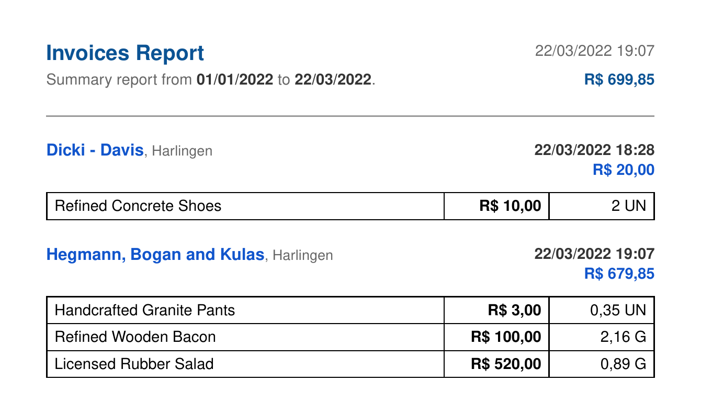

  <h1>:receipt: invoices</h1>
  
RESTful application used to extract and organize online invoices

## Tech

- [Node.js][nodejs] - Node.js is a JavaScript runtime built on Chrome's V8 JavaScript engine
- [TypeScript][typescript] - TypeScript is a superset of JavaScript that compiles to clean JavaScript output
- [PostgreSQL][postgres] - The World's Most Advanced Open Source Relational Database
- [Redis][redis] - Open source in-memory data structure store, used as a database, cache, and message broker

## Project

This is a personal application I used to extract invoices from a government webpage and store them in a Postgres database, so I can **perform queries** and **generate reports** about my expenses. In summary, the application receives an URL we can read from our receipts in Brazil, and using web scrapping we can extract information about the company and products of the invoice.

The project was built with [Node.js][nodejs] and [TypeScript][typescript], storing the extracted information in a [Postgres][postgres] database and processing all the extractions and report generations using job queue with [Redis][redis] and [BullMQ][bullmq]. The extraction of the invoice was performed with [Axios][axios] and [Cheerio][cheerio], and the generation of the reports using [Fast CSV][fastcsv] and [PDF Make][pdfmake].

In the **docs** folder you can find examples of the generated reports, as such an Insomnia collection with the application endpoints. Below is an example of a generated report:

[nodejs]: https://nodejs.org/en/
[typescript]: https://github.com/microsoft/TypeScript
[postgres]: https://www.postgresql.org/
[redis]: https://redis.io
[bullmq]: https://github.com/taskforcesh/bullmq
[axios]: https://github.com/axios/axios
[cheerio]: https://cheerio.js.org
[fastcsv]: https://github.com/C2FO/fast-csv
[pdfmake]: http://pdfmake.org/#/

## License

This project is licensed under the MIT License - see the [LICENSE](LICENSE) file for details.
